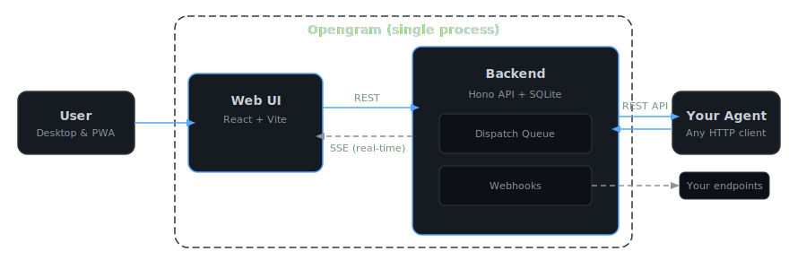

<p align="center">
  <a href="https://opengram.sh">
    
  </a>
</p>

<h1 align="center">Opengram</h1>

<p align="center">
  <strong>Own your Agent Chats</strong><br />
  <em>Discord and Telegram are for people. Opengram is for agents.</em>
</p>

<p align="center">
  
  <a href="./LICENSE"></a>
  <a href="https://opengram.sh/docs"></a>
</p>

<p align="center">
  <a href="https://opengram.sh/docs">Documentation</a> &middot;
  <a href="https://demo.opengram.sh">Live Demo</a> &middot;
  <a href="#quick-start">Quick Start</a> &middot;
  <a href="https://opengram.sh/api-reference">API Reference</a> &middot;
  <a href="https://x.com/CodingBrice">X</a>
</p>

---

Opengram is a self-hosted chat interface and REST API purpose-built for AI agent workflows. A single Node.js process serves both the web UI and a fully documented API -- backed by SQLite, with no external services required. No Redis, no Postgres, no message broker. Any agent runtime that speaks HTTP can create chats, stream messages, upload files, and collect structured input from users.

<p align="center">
  <a href="https://demo.opengram.sh"></a>
</p>

## Quick Start

Install with a single command:

```bash
curl -fsSL https://opengram.sh/install | sh
```

Or install with npm:

```bash
npm install -g @opengramsh/opengram
```

Or run with Docker:

```bash
docker run -d -p 3000:3000 -v opengram_data:/opt/opengram/data ghcr.io/opengramsh/opengram:latest
```

Then run the interactive setup wizard (not needed for Docker):

```bash
opengram init
```

See the [full deployment guide](https://opengram.sh/docs) for Tailscale TLS, reverse proxy, and production configuration.

## 🦞 OpenClaw Integration

Opengram ships an [OpenClaw](https://openclaw.ai) plugin so your openclaw agents can read, write, and search Opengram chats out of the box. The `opengram init` wizard auto-detects OpenClaw and installs the plugin for you.

If you want to add the plugin manually:

```bash
npm install @opengramsh/openclaw-plugin
```

The plugin provides to the openclaw agents a SKILL file and the following tools:

| Tool | Description |
| --- | --- |
| `opengram_chat` | Create chats and send messages |
| `opengram_media` | Upload and attach files, images, and voice notes |
| `opengram_search` | Search across chats, messages, and tags |

Opengram is runtime-agnostic -- any framework that can make HTTP calls works. OpenClaw is just the batteries-included option.

## Features

### API and Integration

- **Runtime-agnostic REST API** -- 25+ endpoints across 12 resource groups (Chats, Messages, Media, Files, Requests, Dispatch, Events, Config, Push, Search, Tags, Health)
- **OpenAPI 3.1 spec** at `/api/v1/doc`, interactive Scalar reference at `/api/v1/reference`
- **Real-time SSE** with cursor-based replay for resumable event streams
- **Webhooks** -- HMAC-signed event delivery with configurable filters, retry, and backoff

### Agent Capabilities

- **Message streaming** -- create a message, append chunks, then complete or cancel. The UI renders incrementally.
- **Dispatch queue** -- lease-based batch claiming with debounce, typing-awareness, heartbeat, and automatic retry with exponential backoff
- **Files and media** -- multipart or base64 upload, server-generated thumbnails (sharp), range requests for large files

### User Experience

- **Mobile-first PWA** -- installable, standalone, designed for phones first
- **Push notifications** -- Web Push / VAPID with auto-provisioned keys
- **Auto-rename chats** -- LLM-powered, supports Anthropic, OpenAI, Google, xAI, and OpenRouter
- **Tags, archive, pin, search** -- full-text search powered by SQLite FTS5

### Operations

- **Single process, SQLite** -- no external services to provision or maintain
- **Docker or direct install** -- systemd service management, `opengram init` wizard
- **Instance secret auth** -- Bearer token protection with configurable rate limiting
- **Tailscale-friendly** -- `tailscale serve --bg 3000` and you're done

## How It Works

<p align="center">
  
</p>

1. User sends a message in the chat UI.
2. The message becomes a dispatch input. In `batched_sequential` mode (default), the scheduler debounces and respects typing indicators before creating a batch.
3. Your agent worker long-polls `POST /api/v1/dispatch/claim` and receives a batch with compiled content, attachment metadata, and agent ID.
4. The worker processes the batch, sends heartbeats to hold its lease, then calls `/complete` or `/fail`.
5. Every state change is broadcast in real time -- the Web UI receives updates via SSE, and external systems via webhooks.

## Configuration

`opengram init` generates an `opengram.config.json` file (override path with `OPENGRAM_CONFIG_PATH`). It covers:

- **Agents and models** -- define the agents and LLM models available in the UI
- **Security** -- instance secret, read endpoint protection
- **Push** -- Web Push VAPID keys and subject
- **Webhooks** -- event URLs, signing secrets, retry policy
- **Dispatch** -- scheduling mode (`immediate`, `sequential`, `batched_sequential`), debounce, lease, retry
- **Auto-rename** -- LLM provider, model, API key

See the [full configuration docs](https://opengram.sh/docs/configuration) for all options.

## Tech Stack

| Layer | Technology |
| --- | --- |
| API server | [Hono](https://hono.dev) |
| Frontend | React, Vite, Tailwind CSS v4 |
| Database | SQLite via [better-sqlite3](https://github.com/WiseLibs/better-sqlite3) |
| Validation | zod + [@hono/zod-openapi](https://github.com/honojs/middleware/tree/main/packages/zod-openapi) |
| API docs | [Scalar](https://scalar.com) (interactive OpenAPI reference) |
| Language | TypeScript |
| Runtime | Node.js 20+ |

## Development

```bash
git clone https://github.com/opengramsh/opengram.git
cd opengram
npm ci
npm run dev
```

`npm run dev` starts the Hono API server (port 3334) and Vite dev server (port 5173) concurrently with hot reload.

Run tests, type-checking, and lint:

```bash
npm test
npm run typecheck
npm run lint
```

To work on the docs site:

```bash
npm run docs:dev  # starts on port 3001
```

## Documentation

> Browse the interactive API reference at `your-instance/api/v1/reference` -- no external docs needed for endpoint discovery.

| Resource | Link |
| --- | --- |
| Full docs | [opengram.sh/docs](https://opengram.sh/docs) |
| API reference | [opengram.sh/api-reference](https://opengram.sh/api-reference) |
| Quick start | [opengram.sh/docs/quick-start](https://opengram.sh/docs/quick-start) |
| Configuration | [opengram.sh/docs/configuration](https://opengram.sh/docs/configuration) |
| OpenClaw plugin | [opengram.sh/docs/openclaw-plugin](https://opengram.sh/docs/openclaw-plugin) |
| Deployment | [opengram.sh/docs/deployment](https://opengram.sh/docs/deployment) |

## Contributing

Contributions are welcome. Fork the repo, create a branch, and make your changes. Before submitting a PR:

```bash
npm test && npm run typecheck && npm run lint
```

If you're unsure about an approach, open an issue first to discuss it.

## License

```
MIT License

Copyright (c) 2026 Thibaut Brice

Permission is hereby granted, free of charge, to any person obtaining a copy
of this software and associated documentation files (the "Software"), to deal
in the Software without restriction, including without limitation the rights
to use, copy, modify, merge, publish, distribute, sublicense, and/or sell
copies of the Software, and to permit persons to whom the Software is
furnished to do so, subject to the following conditions:

The above copyright notice and this permission notice shall be included in all
copies or substantial portions of the Software.

THE SOFTWARE IS PROVIDED "AS IS", WITHOUT WARRANTY OF ANY KIND, EXPRESS OR
IMPLIED, INCLUDING BUT NOT LIMITED TO THE WARRANTIES OF MERCHANTABILITY,
FITNESS FOR A PARTICULAR PURPOSE AND NONINFRINGEMENT. IN NO EVENT SHALL THE
AUTHORS OR COPYRIGHT HOLDERS BE LIABLE FOR ANY CLAIM, DAMAGES OR OTHER
LIABILITY, WHETHER IN AN ACTION OF CONTRACT, TORT OR OTHERWISE, ARISING FROM,
OUT OF OR IN CONNECTION WITH THE SOFTWARE OR THE USE OR OTHER DEALINGS IN THE
SOFTWARE.
```
